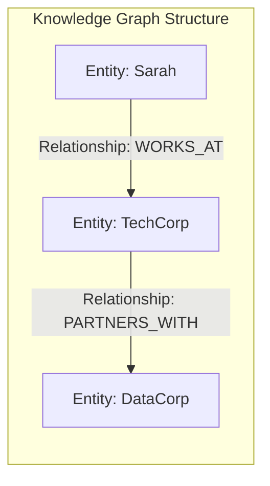
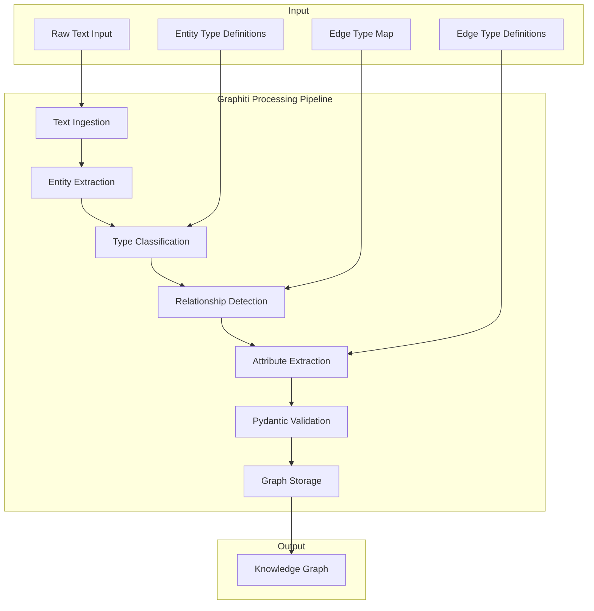
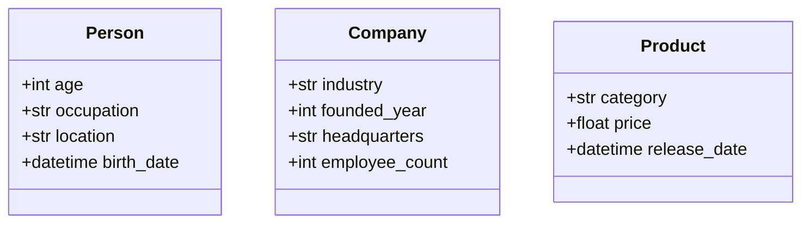
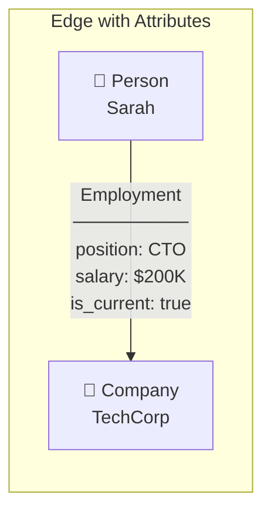
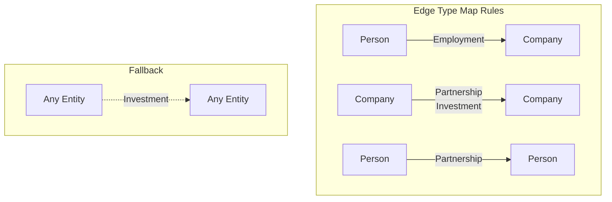
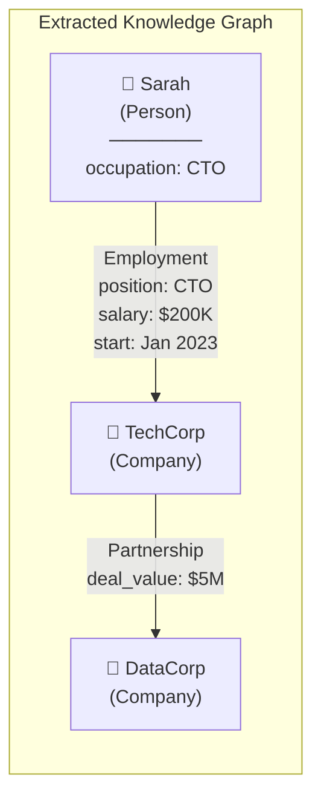
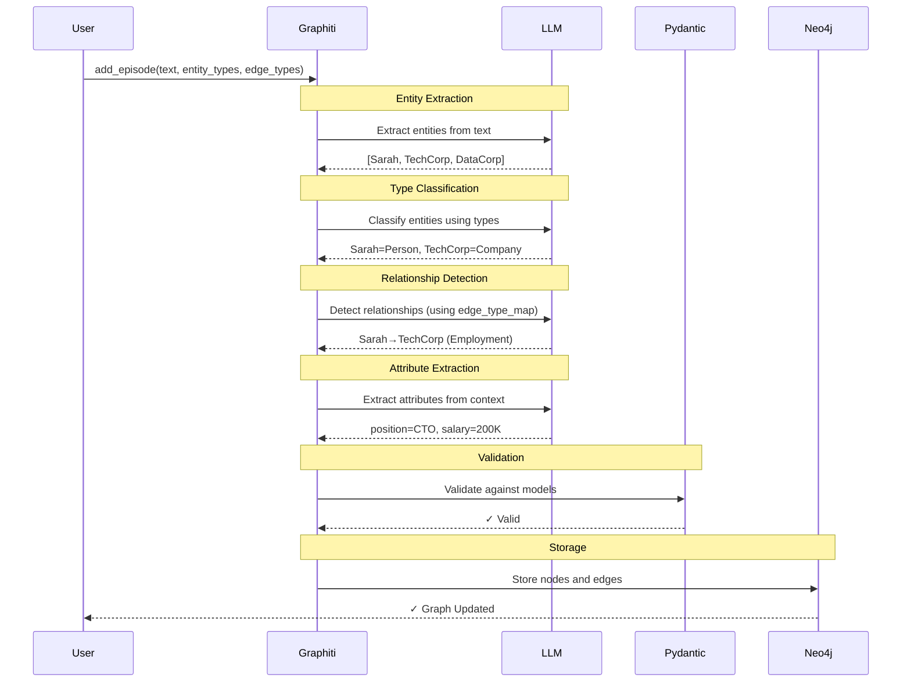
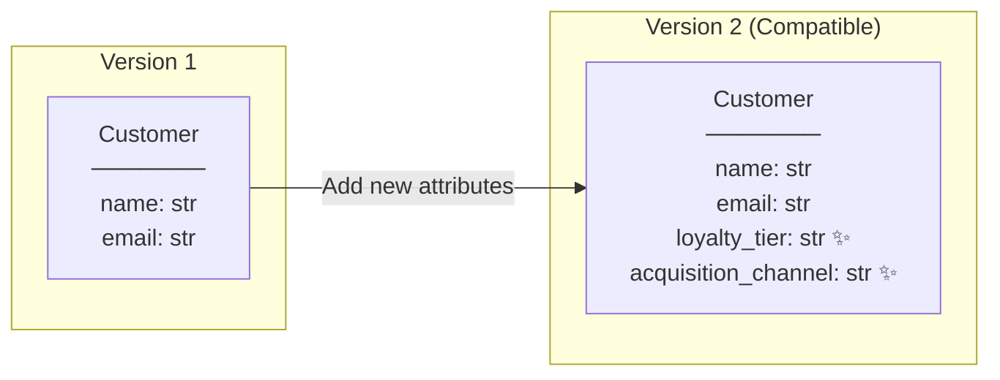
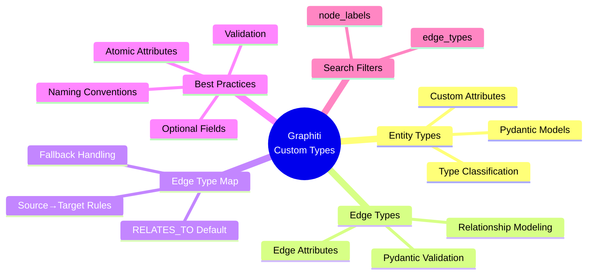

# Graphiti Custom Entity & Edge Types
## A Comprehensive Technical Report

---

## Executive Summary

Graphiti is a knowledge graph framework that enables structured extraction of entities and relationships from unstructured text. This report covers **custom entity types** and **edge types** — powerful features that allow domain-specific modeling of your knowledge graph.

---

## 1. Core Concepts

### 1.1 What is a Knowledge Graph?

A knowledge graph represents information as a network of **nodes** (entities) connected by **edges** (relationships).



| Component | Description | Example |
|-----------|-------------|---------|
| **Node** | A thing/concept | Person, Company, Product |
| **Edge** | A relationship | Employment, Partnership |
| **Attribute** | Property of node/edge | age, salary, start_date |

### 1.2 Why Custom Types?

| Without Custom Types | With Custom Types |
|---------------------|-------------------|
| Generic "Entity" nodes | Typed nodes (Person, Company) |
| Simple `RELATES_TO` edges | Rich relationship types (Employment) |
| No structured attributes | Domain-specific attributes |
| Limited query filtering | Type-based filtering |

---

## 2. Architecture Overview



---

## 3. Defining Custom Entity Types

Entity types are defined using **Pydantic models**. Each model represents a category of node with specific attributes.

### 3.1 Basic Structure

```python
from pydantic import BaseModel, Field
from datetime import datetime
from typing import Optional

class Person(BaseModel):
    """A person entity with biographical information."""
    age: Optional[int] = Field(None, description="Age of the person")
    occupation: Optional[str] = Field(None, description="Current occupation")
    location: Optional[str] = Field(None, description="Current location")
    birth_date: Optional[datetime] = Field(None, description="Date of birth")
```

### 3.2 Entity Type Examples



### 3.3 Complete Entity Definitions

```python
class Company(BaseModel):
    """A business organization."""
    industry: Optional[str] = Field(None, description="Primary industry")
    founded_year: Optional[int] = Field(None, description="Year founded")
    headquarters: Optional[str] = Field(None, description="HQ location")
    employee_count: Optional[int] = Field(None, description="Number of employees")

class Product(BaseModel):
    """A product or service."""
    category: Optional[str] = Field(None, description="Product category")
    price: Optional[float] = Field(None, description="Price in USD")
    release_date: Optional[datetime] = Field(None, description="Release date")
```

---

## 4. Defining Custom Edge Types

Edge types define **relationships** between entities with their own attributes.

### 4.1 Edge Type Structure

```python
class Employment(BaseModel):
    """Employment relationship between person and company."""
    position: Optional[str] = Field(None, description="Job title")
    start_date: Optional[datetime] = Field(None, description="Start date")
    end_date: Optional[datetime] = Field(None, description="End date")
    salary: Optional[float] = Field(None, description="Annual salary USD")
    is_current: Optional[bool] = Field(None, description="Current employment")
```

### 4.2 Edge Visualization



### 4.3 Additional Edge Types

```python
class Investment(BaseModel):
    """Investment relationship between entities."""
    amount: Optional[float] = Field(None, description="Amount in USD")
    investment_type: Optional[str] = Field(None, description="Type: equity, debt")
    stake_percentage: Optional[float] = Field(None, description="Ownership %")
    investment_date: Optional[datetime] = Field(None, description="Date")

class Partnership(BaseModel):
    """Partnership between companies."""
    partnership_type: Optional[str] = Field(None, description="Type")
    duration: Optional[str] = Field(None, description="Expected duration")
    deal_value: Optional[float] = Field(None, description="Financial value")
```

---

## 5. Edge Type Mapping

The **edge_type_map** defines which edge types can connect which entity type pairs.

### 5.1 Mapping Structure

```python
edge_type_map = {
    ("Person", "Company"): ["Employment"],
    ("Company", "Company"): ["Partnership", "Investment"],
    ("Person", "Person"): ["Partnership"],
    ("Entity", "Entity"): ["Investment"],  # Fallback for any types
}
```

### 5.2 Mapping Visualization



### 5.3 How Mapping Works

| Source Entity | Target Entity | Allowed Edge Types |
|---------------|---------------|-------------------|
| Person | Company | Employment |
| Company | Company | Partnership, Investment |
| Person | Person | Partnership |
| Any | Any | Investment (fallback) |
| Unmapped pair | Unmapped pair | RELATES_TO (default) |

---

## 6. Complete Usage Example

### 6.1 Setup

```python
from datetime import datetime
from pydantic import BaseModel, Field
from typing import Optional
from graphiti_core import Graphiti

# Initialize Graphiti client
graphiti = Graphiti(uri="bolt://localhost:7687", user="neo4j", password="password")
```

### 6.2 Define Types

```python
# Entity Types
entity_types = {
    "Person": Person,
    "Company": Company,
    "Product": Product
}

# Edge Types
edge_types = {
    "Employment": Employment,
    "Investment": Investment,
    "Partnership": Partnership
}

# Edge Type Map
edge_type_map = {
    ("Person", "Company"): ["Employment"],
    ("Company", "Company"): ["Partnership", "Investment"],
    ("Person", "Person"): ["Partnership"],
    ("Entity", "Entity"): ["Investment"],
}
```

### 6.3 Add Episode

```python
await graphiti.add_episode(
    name="Business Update",
    episode_body="Sarah joined TechCorp as CTO in January 2023 with a $200K salary. "
                 "TechCorp partnered with DataCorp in a $5M deal.",
    source_description="Business news",
    reference_time=datetime.now(),
    entity_types=entity_types,
    edge_types=edge_types,
    edge_type_map=edge_type_map
)
```

### 6.4 Resulting Graph



---

## 7. Searching with Custom Types

### 7.1 Filter by Entity Type

```python
from graphiti_core.search.search_filters import SearchFilters

# Only return Person and Company entities
search_filter = SearchFilters(
    node_labels=["Person", "Company"]
)

results = await graphiti.search_(
    query="Who works at tech companies?",
    search_filter=search_filter
)
```

### 7.2 Filter by Edge Type

```python
# Only return Employment and Partnership edges
search_filter = SearchFilters(
    edge_types=["Employment", "Partnership"]
)

results = await graphiti.search_(
    query="Tell me about business relationships",
    search_filter=search_filter
)
```

---

## 8. Processing Pipeline



---

## 9. Best Practices

### 9.1 Model Design

| Practice | ✅ Do | ❌ Don't |
|----------|-------|---------|
| Field types | Use specific types (`int`, `datetime`) | Use `str` for everything |
| Optionality | Make fields `Optional` | Use required fields |
| Descriptions | Detailed, actionable descriptions | Vague or missing descriptions |
| Validation | Add Pydantic validators | Skip validation |
| Atomicity | Break into smallest units | Store compound data |

### 9.2 Atomic Attributes

```python
# ❌ BAD: Compound attribute
class Customer(BaseModel):
    contact_info: Optional[str]  # "John Doe, john@email.com"

# ✅ GOOD: Atomic attributes
class Customer(BaseModel):
    name: Optional[str] = Field(None, description="Customer name")
    email: Optional[str] = Field(None, description="Email address")
```

### 9.3 Naming Conventions

| Element | Convention | Example |
|---------|------------|---------|
| Entity Types | PascalCase | `Person`, `TechCompany` |
| Edge Types | PascalCase | `Employment`, `Partnership` |
| Attributes | snake_case | `start_date`, `employee_count` |

### 9.4 Custom Validation

```python
from pydantic import validator

class Person(BaseModel):
    """A person entity."""
    age: Optional[int] = Field(None, description="Age in years")
    
    @validator('age')
    def validate_age(cls, v):
        if v is not None and (v < 0 or v > 150):
            raise ValueError('Age must be between 0 and 150')
        return v
```

---

## 10. Constraints & Limitations

### 10.1 Protected Attribute Names

These names are reserved by Graphiti's core `EntityNode` class and **cannot** be used:

| Protected Name | Purpose |
|----------------|---------|
| `uuid` | Unique identifier |
| `name` | Entity name |
| `group_id` | Grouping identifier |
| `labels` | Node labels |
| `created_at` | Creation timestamp |
| `summary` | Entity summary |
| `attributes` | Attribute storage |
| `name_embedding` | Vector embedding |

### 10.2 Entity Exclusion

Exclude specific entity types from extraction:

```python
await graphiti.add_episode(
    name="Meeting Notes",
    episode_body="The meeting discussed weather and sports.",
    source_description="Notes",
    reference_time=datetime.now(),
    entity_types=entity_types,
    excluded_entity_types=["Person"]  # Won't extract Person entities
)
```

---

## 11. Schema Evolution

Graphiti supports **backward-compatible** schema evolution:



> **Key Point**: Existing nodes preserve their original attributes while supporting new ones for future updates.

---

## 12. Summary



---

## Appendix: Quick Reference

### A. Entity Type Template

```python
class EntityName(BaseModel):
    """Description of the entity type."""
    attribute_name: Optional[type] = Field(None, description="Clear description")
```

### B. Edge Type Template

```python
class EdgeName(BaseModel):
    """Description of the relationship."""
    attribute_name: Optional[type] = Field(None, description="Clear description")
```

### C. Complete Integration Template

```python
entity_types = {"TypeName": TypeClass, ...}
edge_types = {"EdgeName": EdgeClass, ...}
edge_type_map = {("Source", "Target"): ["EdgeName"], ...}

await graphiti.add_episode(
    name="Episode Name",
    episode_body="Text content...",
    source_description="Source",
    reference_time=datetime.now(),
    entity_types=entity_types,
    edge_types=edge_types,
    edge_type_map=edge_type_map
)
```

---

*Report generated on 2025-12-19*
