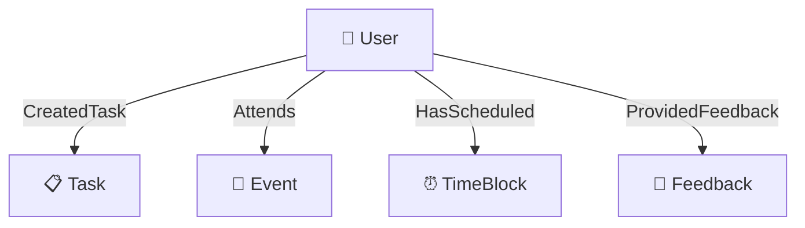
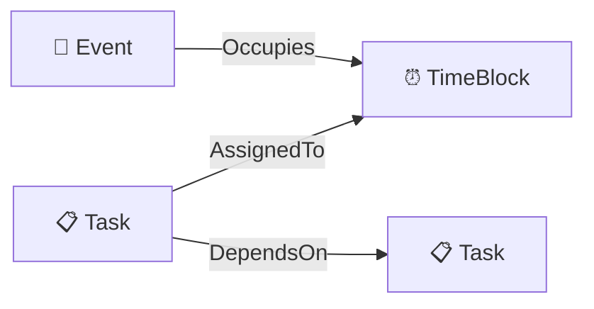
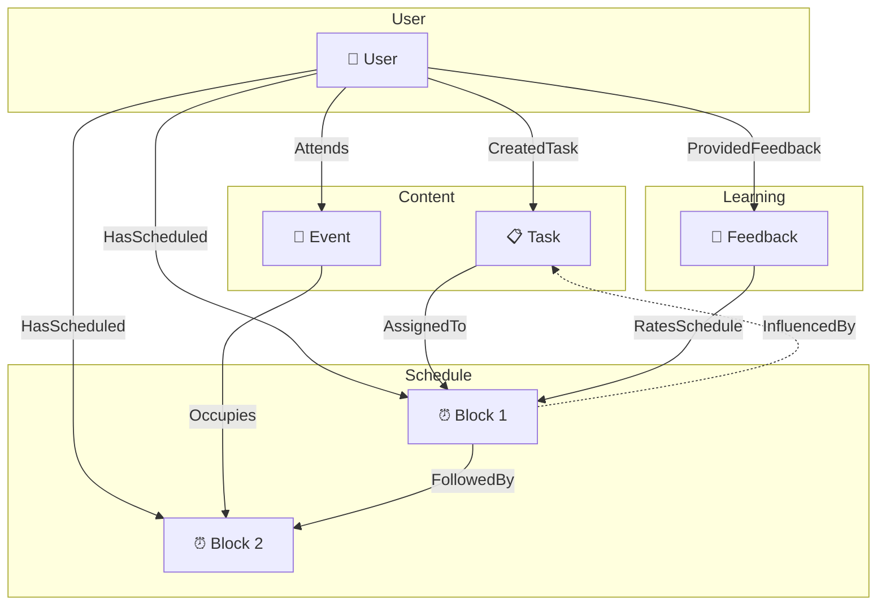

# Pulse Knowledge Graph Schema (v4)

## Entity Types

### 1. User

**Role:** Represents the Pulse user. Stores learned scheduling preferences.

| Attribute | Type | Description | Validator |
|-----------|------|-------------|-----------|
| `preferred_wake_time` | Optional[int] | The hour (0-23) when user typically begins their active day. Reflects natural circadian rhythm and morning availability window. | 0 ≤ v ≤ 23 |
| `preferred_sleep_time` | Optional[int] | The hour (0-23) when user typically ends their productive day. Defines the boundary for scheduling activities. | 0 ≤ v ≤ 23 |
| `focus_duration_preference` | Optional[int] | Optimal uninterrupted work session length in minutes. Reflects user's attention span and deep work capacity. | v > 0 |
| `break_duration_preference` | Optional[int] | Preferred rest interval length in minutes between work sessions. Reflects recovery needs and work rhythm. | v > 0 |
| `productivity_style` | Optional[str] | User's chronotype pattern: "morning_person" (peak energy early), "night_owl" (peak energy late), "flexible" (adaptable). Determines optimal scheduling windows. | enum |

---

### 2. Task

**Role:** Work item to be scheduled. Created from natural language parsing in Task 1.

| Attribute | Type | Description | Validator |
|-----------|------|-------------|-----------|
| `category` | Optional[str] | Domain classification of the task: "work" (professional), "study" (learning), "exercise" (physical), "personal" (life admin), "errands" (logistics). Informs energy matching and grouping. | None |
| `estimated_duration_minutes` | Optional[int] | User's predicted time requirement in minutes. Used to detect estimation bias over time by comparing with actual duration. | v > 0 |
| `actual_duration_minutes` | Optional[int] | Real time taken to complete the task in minutes. Enables learning of user's estimation accuracy per category. | v > 0 |
| `priority_level` | Optional[int] | Urgency and importance ranking from 1 (must complete today, high stakes) to 5 (optional, no deadline pressure). Drives scheduling order. | 1 ≤ v ≤ 5 |
| `energy_required` | Optional[str] | Cognitive load classification: "high" (creative, analytical, complex), "medium" (moderate focus), "low" (routine, administrative). Enables energy-aware scheduling. | enum |
| `is_completed` | Optional[bool] | Completion status. True indicates successful execution, providing positive reinforcement signal for the scheduling pattern used. | None |
| `external_id` | Optional[str] | Stable identifier for entity resolution. Prevents duplicate nodes when same task appears across multiple interactions. | None |

---

### 3. Event

**Role:** Fixed calendar commitment. Cannot be moved by solver.

| Attribute | Type | Description | Validator |
|-----------|------|-------------|-----------|
| `event_type` | Optional[str] | Nature of commitment: "meeting" (collaborative), "class" (educational), "appointment" (personal obligation), "recurring" (repeated commitment). Informs flexibility and priority. | None |
| `is_flexible` | Optional[bool] | Whether the event time can be adjusted by the solver. False for hard commitments, True for soft blocks that can shift if needed. | None |
| `is_recurring` | Optional[bool] | Whether the event repeats on a pattern. Enables pattern recognition and anticipatory scheduling. | None |
| `recurrence_pattern` | Optional[str] | Repetition frequency: "daily", "weekly", "monthly". Only applicable when is_recurring is True. | None |
| `external_id` | Optional[str] | Calendar system identifier for deduplication. Prevents duplicate nodes during calendar synchronization. | None |

---

### 4. TimeBlock

**Role:** Scheduled time slot. Output from Task 2 solver.

| Attribute | Type | Description | Validator |
|-----------|------|-------------|-----------|
| `block_type` | Optional[str] | Purpose classification: "focus" (deep work), "break" (recovery), "buffer" (transition/flex time), "meeting" (collaborative). Determines task assignment eligibility. | enum |
| `scheduled_start_hour` | Optional[int] | Block start time hour component in 24-hour format (0-23). | 0 ≤ v ≤ 23 |
| `scheduled_start_minute` | Optional[int] | Block start time minute component (0-59). | 0 ≤ v ≤ 59 |
| `scheduled_duration_minutes` | Optional[int] | Total block length in minutes. Represents allocated time window for the activity. | v > 0 |
| `was_completed` | Optional[bool] | Whether user executed this block as scheduled. True provides positive reinforcement for the time slot selection. | None |
| `was_rescheduled` | Optional[bool] | Whether user moved this block from its original time. True indicates scheduling mismatch requiring preference adjustment. | None |
| `origin` | Optional[str] | Creation source: "solver" (algorithm-generated) or "user_created" (manually added). Enables provenance tracking and learning differentiation. | enum |
| `schedule_run_id` | Optional[str] | Unique identifier of the schedule generation session. Enables versioning and historical comparison. | None |

---

### 5. Feedback

**Role:** User's reaction to schedule. Captures explicit/implicit signals for learning.

| Attribute | Type | Description | Validator |
|-----------|------|-------------|-----------|
| `feedback_type` | Optional[str] | User action classification: "accepted" (no changes, strong positive), "edited" (modified, learning signal), "rejected" (full regeneration requested, strong negative). | enum |
| `feedback_source` | Optional[str] | Signal origin: "explicit_rating" (user deliberately rated), "implicit_behavior" (derived from user actions like moving blocks). Informs signal reliability. | enum |
| `rating` | Optional[int] | User satisfaction score from 1 (very dissatisfied) to 5 (very satisfied). Only present for explicit ratings. | 1 ≤ v ≤ 5 |
| `edit_distance_minutes` | Optional[int] | Magnitude of time shift in minutes from original to edited position. Larger values indicate stronger preference mismatch. | v ≥ 0 |
| `original_start_hour` | Optional[int] | Block start hour before user modification. Captures what the system proposed. | 0 ≤ v ≤ 23 |
| `new_start_hour` | Optional[int] | Block start hour after user modification. Captures what the user actually wanted. | 0 ≤ v ≤ 23 |
| `reason` | Optional[str] | User-provided explanation for the feedback. Rich semantic context for understanding preference nuances. | None |
| `confidence` | Optional[float] | Signal reliability score from 0.0 (uncertain, noisy) to 1.0 (highly reliable, consistent pattern). Prevents overfitting to single interactions. | 0.0 ≤ v ≤ 1.0 |

---

## Edge Types

| Edge Type | From → To | Purpose |
|-----------|-----------|---------|
| `CreatedTask` | User → Task | User authored this task |
| `Attends` | User → Event | User participates in this event |
| `HasScheduled` | User → TimeBlock | User has this block in schedule |
| `ProvidedFeedback` | User → Feedback | User submitted this feedback |
| `AssignedTo` | Task → TimeBlock | Task placed in this slot |
| `DependsOn` | Task → Task | Task ordering constraint |
| `Occupies` | Event → TimeBlock | Event takes this slot |
| `RatesSchedule` | Feedback → TimeBlock | Feedback about specific block |
| `InfluencedBy` | TimeBlock → Task/Event | Provenance: inputs that shaped this block |
| `FollowedBy` | TimeBlock → TimeBlock | Temporal sequence for pattern learning |

---

## Edge Type Map

```python
edge_type_map = {
    # User relationships
    ("User", "Task"): ["CreatedTask"],
    ("User", "Event"): ["Attends"],
    ("User", "TimeBlock"): ["HasScheduled"],
    ("User", "Feedback"): ["ProvidedFeedback"],
    
    # Task relationships
    ("Task", "TimeBlock"): ["AssignedTo"],
    ("Task", "Task"): ["DependsOn"],
    
    # Event relationships
    ("Event", "TimeBlock"): ["Occupies"],
    
    # Feedback relationships
    ("Feedback", "TimeBlock"): ["RatesSchedule"],
    
    # Provenance & Sequence
    ("TimeBlock", "Task"): ["InfluencedBy"],
    ("TimeBlock", "Event"): ["InfluencedBy"],
    ("TimeBlock", "TimeBlock"): ["FollowedBy"],
    
    # Fallback
    ("Entity", "Entity"): ["RELATES_TO"]
}
```

---

## Graph Diagrams

### User Relationships



### Content → Schedule



### Temporal Sequence


### Complete Graph



---

## Best Practices Compliance

| Practice | Status |
|----------|--------|
| PascalCase entity types | ✅ |
| PascalCase edge types | ✅ |
| snake_case attributes | ✅ |
| Optional fields | ✅ |
| Specific types (int, bool) | ✅ |
| Atomic attributes | ✅ |
| No protected names | ✅ |
| Semantic descriptions (not limiting) | ✅ |
| Validators defined | ✅ |
| Fallback edge type | ✅ |
| Temporal sequence edge | ✅ |
